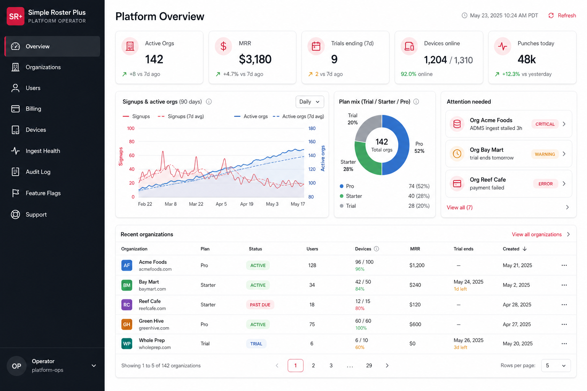
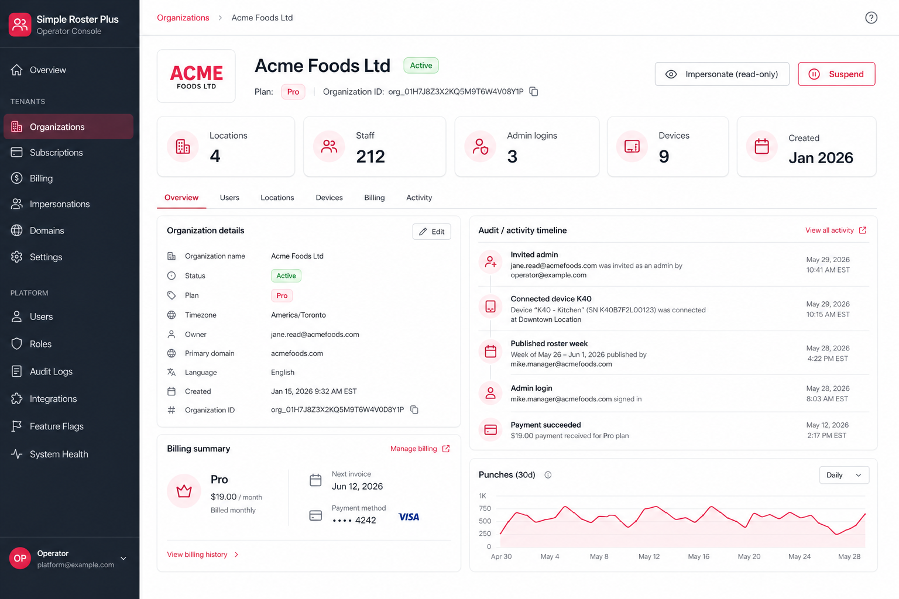
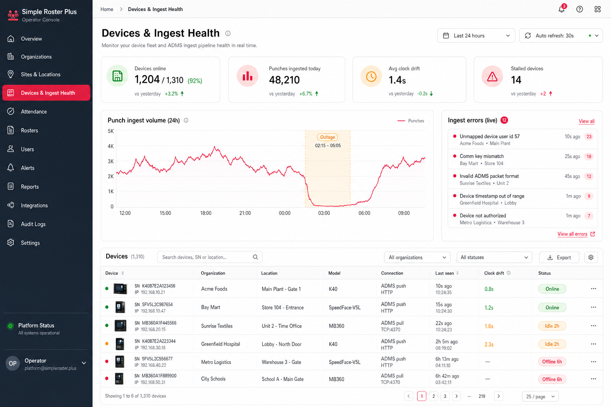
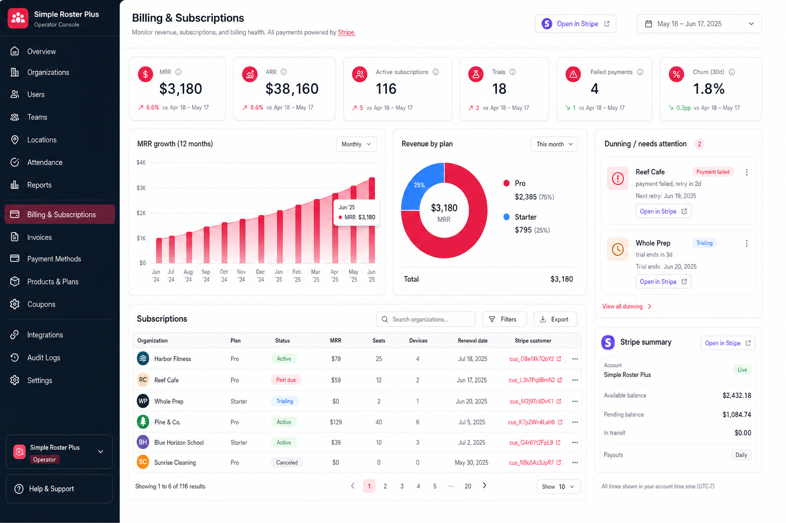

# Operator Console — platform admin/management plane (design)

**Status:** Design / not implemented. No app code exists for this yet; this doc is the
authoritative spec to build against.

**Purpose:** Capture the design for the **platform operator console** — the internal
super-admin surface SR+ staff use to administer *all* customers and organizations
(monitoring, billing, devices, support). This is distinct from the customer-facing
tenant admin already covered in `docs/AGENT_CONTEXT_GTM_AUTH_PRICING.md`.

**Product:** Simple Roster Plus (SR+) — B2B roster + attendance (ZKTeco / ADMS),
Next.js + Prisma + PostgreSQL, multi-tenant via `Organization`.

**Related docs:** `docs/AGENT_CONTEXT_GTM_AUTH_PRICING.md`, `docs/PRODUCT_NOTES.md`,
`README.md`, `prisma/schema.prisma`

---

## Executive summary

| Area | Decision |
|------|----------|
| **Two planes** | Tenant admin (`app.simplerosterplus.com`) vs **operator console** (`admin.simplerosterplus.com`) are separate surfaces |
| **Hosting** | Operator console on its **own subdomain** `admin.simplerosterplus.com` |
| **Auth** | **Separate, self-contained auth** — a dedicated **Clerk application** for operators, *not* a role on a customer account |
| **Access gate** | Clerk auth **plus** an `OperatorUser` allow-list row (defense in depth); **MFA required** |
| **Payments** | **Stripe** (source of truth for money); SR+ mirrors minimal state + reacts to webhooks |
| **Visual system** | **Must match the existing app**: emerald primary, zinc neutrals, amber warnings, Geist fonts (see [Visual consistency](#visual-consistency-required)) |
| **v1 shape** | **Read-mostly**: dashboards + a small set of audited write actions (suspend, extend trial, refund, impersonate) |

---

## 0. The two admin planes (why this exists)

"Admin" is overloaded. There are two completely separate consoles; only the first was
previously planned.

| | **Tenant admin** (planned) | **Operator console** (this doc) |
|---|---|---|
| Who | A customer's org owner / scheduler | **SR+ internal staff** |
| Scope | One `Organization` | **All** orgs across the deployment |
| Lives at | `app.simplerosterplus.com` (`/roster`, `/staff`, `/settings`) | `admin.simplerosterplus.com` |
| Auth | Customer Clerk app (org membership) | **Separate** Clerk app + `OperatorUser` allow-list |
| Examples | Approve leave, edit a punch | Suspend a delinquent org, refund a charge, watch the device fleet |

The data model is **already tenant-scoped on `Organization`**, which is the exact
foundation an operator console needs. This is an additive cross-tenant read/control layer,
not a refactor.

---

## Visual consistency (REQUIRED)

> **Build note (do not skip):** The operator console **must match the existing app's
> visual language** for a consistent experience. The mockups in this doc were generated
> with a rose/crimson accent — that is **wrong**; rose is the app's *Requests* accent, not
> the primary. Re-tone all operator UI to the tokens below before/while building.

Source of truth: `app/globals.css`, `app/layout.tsx`, `app/components/app-nav.tsx`.

| Token | Value | Usage |
|-------|-------|-------|
| **Primary accent** | **emerald** (`emerald-700` / `emerald-50` / `emerald-900`) | active nav, primary buttons, key stats |
| **Neutrals** | **zinc** (`zinc-600`, `zinc-50`, borders) | text, surfaces, dividers |
| **Warning** | **amber** (`amber-50` / `amber-900` / `amber-200`) | setup/attention/idle states |
| **Danger** | rose/red (`rose-600`, `red-*`) | destructive actions, offline/failed pills |
| **Fonts** | **Geist Sans** (`--font-geist-sans`), **Geist Mono** (`--font-geist-mono`) | body / numeric + IDs |
| **Surfaces** | white background, rounded cards, subtle zinc borders | matches roster/attendance/devices pages |

Status pills follow the existing app convention: **emerald = healthy/online/active**,
**amber = idle/attention/trialing**, **rose/red = offline/failed/past-due**.

A subtle operator-only signal (e.g. a darker top bar or an "OPERATOR" wordmark lockup) is
fine to signal "internal tool", but the palette, type, spacing, and components stay in the
SR+ system. Reuse existing component patterns rather than inventing a parallel kit.

---

## 1. Hosting & routing (subdomain split)

```
simplerosterplus.com         → marketing / landing
app.simplerosterplus.com     → customer tenant app   (customer Clerk app)
admin.simplerosterplus.com   → operator console      (operator Clerk app)
/iclock/*                    → device ADMS callbacks  (device auth, separate)
```

- The subdomain split is what makes the trust boundary real: **different session cookies,
  different identity pools, no cross-bleed**.
- Implementation can be the **same Next.js deployment** with host-based routing in
  middleware, or a **separate app** — either is fine. Same deployment is cheaper to start;
  the hard boundary comes from auth + cookie scoping, not the deployment topology.
- Operator data access lives in an isolated, obviously named module (e.g. `lib/ops/*`) that
  **intentionally bypasses `where: { organizationId }` scoping**. This is the highest-risk
  code path in the system and must be unreachable without passing the operator gate.

---

## 2. Auth — operator console handles its own (elaboration)

**Decision: the operator console handles its own auth, separate from the customer app.**
Concretely a **dedicated Clerk application** bound to `admin.simplerosterplus.com`, *not* a
role flag inside the customer Clerk app.

### Why a hard split (not "an admin role on a normal account")

1. **Trust boundary by construction.** `app.` and `admin.` become two different identity
   pools with cookies scoped to different subdomains. A customer cannot exist in the
   operator pool, so no customer-side escalation (leaked token, mis-set
   `publicMetadata.role`, IDOR) can cross into the platform control plane. If "super-admin"
   were an attribute on a customer-shaped identity, one bad metadata write = full platform
   compromise.
2. **Stricter posture for a larger blast radius.** The console crosses *all* tenants, so it
   gets **mandatory MFA**, short sessions, and optionally IP/SSO restriction — without
   imposing that friction on every customer admin.
3. **Cheap & clean on Clerk.** The operator userbase is ~5 internal people, so a second
   Clerk app is effectively free and keeps customer MRU/MRO billing uncontaminated.
4. **Defense in depth via allow-list.** Valid auth in the operator Clerk app is *not*
   sufficient — access also requires an `OperatorUser` row (provisioned, role-scoped,
   revocable). Auth proves *who you are*; the allow-list proves *you may operate the plane*.

### What it is not

- **Not** custom password auth — Clerk is already the chosen provider; this is just a
  *separate Clerk instance*, reusing the same integration patterns.
- **Not** the customer Clerk Organizations system.
- **Not** a shared cookie/session with the customer app.

### Mechanics

- `clerkMiddleware` scoped to the `admin.` host using the **operator Clerk app keys**
  (separate `*_OPERATOR` env vars).
- After Clerk auth, resolve the user against `OperatorUser` (by `clerkUserId` or verified
  internal email). No row → 403, even with valid Clerk auth.
- Operator role (`superadmin` / `support` / `billing` / `readonly`) gates which actions are
  available (see RBAC below).
- Every privileged action writes an `OperatorAuditLog` row (actor + before/after).

---

## 3. Functionality (modules)

MVP-flagged so the build is staged, not boil-the-ocean.

### 3.1 Organizations / tenants — *MVP*
- Searchable list of all orgs: plan, status, # locations/staff/devices/admins, created,
  trial/demo flags.
- Org 360 detail: owner, timezone, lifecycle (demo → trial → paid), audit timeline,
  billing summary, attendance sparkline.
- Lifecycle actions (audited, confirm-dialog'd): **suspend / reactivate / delete**, extend
  trial, convert demo → trial, manual plan change (comps/discounts).

### 3.2 Billing & payments (Stripe) — *MVP*
- Stripe is the **source of truth for money**; SR+ mirrors minimal state and reacts to
  webhooks. Deep-link "Open in Stripe" instead of rebuilding Stripe's UI.
- MRR / ARR, plan mix, failed payments, churn, **dunning queue**.
- Webhooks (`invoice.payment_failed`, `customer.subscription.updated`,
  `customer.subscription.deleted`, `checkout.session.completed`) drive status pills and the
  dunning list.

### 3.3 Device fleet & ADMS ingest health — *MVP-ish (key differentiator)*
- Cross-org fleet: online / idle / offline (uses existing `Device.lastSeenAt`,
  `lastUserCount`, `lastPunchCount`, `lastFingerprintCount`).
- Ingest observability: punch volume over time, outage detection, **clock drift** (existing
  `AttendanceDeviceClock.offsetMs`, `AttendanceLog.clockOffsetMsApplied`), comm-key
  mismatches, **unmapped device punches** (existing `lib/unmapped-device-punches.ts`,
  nullable `AttendanceLog.staffId`).
- Converts the #1 support liability ("our clock-ins vanished") into a dashboard you see
  *before* the angry call.

### 3.4 Monitoring / system health — *MVP-lite*
- Product-shaped health: error rate, p95 latency, `/iclock/*` endpoint health, job/queue
  lag, Neon compute (ties to `docs/OPTIMIZATION_BASELINE.md`).
- Lean on **Sentry + Vercel + Neon** for raw infra; the console surfaces product-shaped
  signals ("N orgs have a stalled device"), not a re-implemented Grafana.

### 3.5 Users & access (cross-tenant) — *MVP*
- Find any `AppUser` / Clerk user across orgs; see org memberships; resend invites; force
  sign-out.

### 3.6 Support tooling — *do early*
- **Read-only impersonation** ("view as this org") — biggest support accelerator. Must be
  **audited and time-boxed**.
- Per-org notes, support flags, links to conversations.

### 3.7 Audit log — *MVP (non-negotiable for a control plane)*
- Every operator action (suspend, refund, impersonate, plan change) → immutable record with
  actor + before/after. Extends the existing audit-FK habit (`decidedByUserId`,
  `createdByUserId`).

### 3.8 Feature flags / rollout — *later*
- Per-org flag overrides for staged rollout, betas, per-customer enablement.

### 3.9 Comms / lifecycle — *later*
- Broadcast/maintenance banners, targeted nudges ("trial ending"), changelog.

---

## 4. Schema additions (none of this exists yet — all additive)

```prisma
// Billing / lifecycle on the existing tenant root.
model Organization {
  // ... existing fields ...
  stripeCustomerId     String?  @unique
  stripeSubscriptionId String?  @unique
  plan                 String?           // "trial" | "starter" | "pro" | ...
  subscriptionStatus   String?           // mirror of Stripe status
  currentPeriodEnd     DateTime?
  trialEndsAt          DateTime?
  isDemo               Boolean  @default(false)
  demoExpiresAt        DateTime?
  suspendedAt          DateTime?
  // (clerkOrgId already proposed in AGENT_CONTEXT_GTM_AUTH_PRICING.md)
}

// Operator allow-list (separate from customer AppUser).
model OperatorUser {
  id          String   @id @default(cuid())
  clerkUserId String?  @unique          // from the OPERATOR Clerk app
  email       String   @unique
  role        String   @default("readonly") // superadmin | support | billing | readonly
  disabledAt  DateTime?
  createdAt   DateTime @default(now())
  updatedAt   DateTime @updatedAt
}

// Immutable operator audit trail.
model OperatorAuditLog {
  id             String   @id @default(cuid())
  operatorUserId String
  action         String                    // "org.suspend" | "billing.refund" | "impersonate.start" | ...
  targetType     String                    // "organization" | "appUser" | "device" | ...
  targetId       String?
  organizationId String?                   // affected tenant, when applicable
  metadata       Json?                     // before/after, reason
  createdAt      DateTime @default(now())

  @@index([organizationId])
  @@index([operatorUserId])
  @@index([action, createdAt])
}
```

Billing values are **mirrors** of Stripe, kept only so the console can render lists and
trigger alerts without a Stripe round-trip per row.

---

## 5. Security model

- **Separate auth pool + allow-list + MFA** (section 2).
- **Isolated cross-tenant data layer** (`lib/ops/*`) that is the only place tenant scoping
  is intentionally bypassed.
- **Read-mostly v1**: writes limited to suspend / reactivate / extend trial / refund /
  impersonate, each behind a confirm dialog and an `OperatorAuditLog` entry.
- **RBAC** by operator role: `readonly` (view), `support` (impersonate, notes),
  `billing` (refunds, plan changes), `superadmin` (suspend/delete, manage operators).
- **No Stripe secrets in the browser**; all Stripe calls server-side; webhooks signature-verified.

---

## 6. Build order

1. **Operator gate** (separate Clerk app + `OperatorUser` allow-list + `admin.` host routing).
2. **Org list + Org 360 (read-only)** — instant operational visibility, zero risk.
3. **Stripe integration + Billing module** — can't launch a SaaS without it.
4. **Device / ingest health** — turns the biggest support liability into a dashboard.
5. **Audited write actions** (suspend, extend trial, refund, impersonate) + Audit log.
6. **Feature flags, comms, deeper monitoring** — as scale demands.

---

## 7. Env vars (add when implementing)

```
# Operator Clerk app (separate from customer Clerk keys)
NEXT_PUBLIC_CLERK_OPERATOR_PUBLISHABLE_KEY
CLERK_OPERATOR_SECRET_KEY
CLERK_OPERATOR_WEBHOOK_SIGNING_SECRET

# Stripe
STRIPE_SECRET_KEY
STRIPE_WEBHOOK_SIGNING_SECRET
NEXT_PUBLIC_STRIPE_PUBLISHABLE_KEY
```

---

## 8. Mockups

> Reference only. Re-tone from rose to the **emerald/zinc/amber** SR+ palette before
> building (see [Visual consistency](#visual-consistency-required)). Layout, density, and
> information architecture are representative of the target.

**Platform overview / mission control**



**Organization (tenant) 360 detail**



**Device fleet & ADMS ingest health**



**Billing & subscriptions (Stripe)**



---

## 9. Open questions

1. Same Next.js deployment with host routing vs. a separate app for `admin.`?
2. Operator MFA: TOTP only, or require SSO (Google Workspace) for internal staff?
3. How much Stripe state to mirror vs. fetch on demand (lists need mirror; detail can fetch)?
4. Impersonation: read-only only at launch, or a clearly-flagged write mode for support fixes?
5. Plan/SKU shape (per org / per location / per device add-on) — feeds the billing module
   and the pricing open questions in `AGENT_CONTEXT_GTM_AUTH_PRICING.md`.

---

*Last updated: 2026-05-30. Update when auth, hosting, billing, or scope decisions change.*
